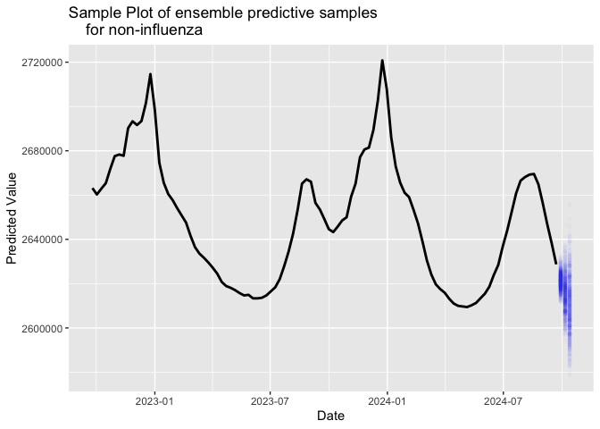
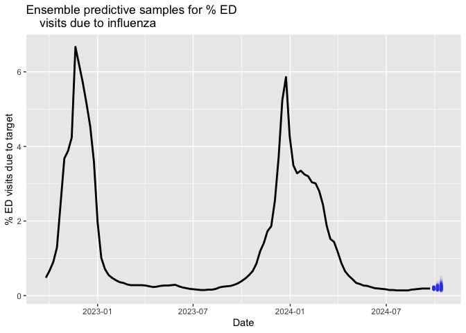

# Count prediction for non-target pathogens


## Forecasting proportions

The goal of this note is to demonstrate a simple forecasting approach
for the *other* pathogens of interest.

Why would we want to do this?

In some situations we might want to forecast the *proportion* of total
incidence/prevalence $P(t)$ due to a particular target pathogen $X(t)$
among the incidence/prevalence of other pathogens $N(t)$:

$$
P(t) = \frac{X(t)}{X(t) + N(t)}.
$$

**In this note, we assume that $X(t)$ and $N(t)$ are independent**.

## Using `forecast_counts`

`forecast_counts` is aimed at providing a forecasting method for $N(t)$
to be used in conjunction with $X(t)$ forecasts; which is where most of
the modelling effort will go due to being the target pathogen of
interest.

First, we load the code:

``` r
library(readr)
library(ggplot2)
source("R/generate_example_data.R")
source("R/forecast_counts.R")
```

## Example: non-influenza causes of emergency department visits

In this example, we’ll look at emergency department (ED) visits. We’ll
use influenza as our target, which means we’ll actually be forecasting
the combined incidence of Covid, RSV and other non-respiratory causes of
ED visits.

``` r
target <- "influenza"
```

As an example data set we generate as very rough estimate of *total* ED
visits in the USA. The approximation scheme is based on these
assumptions:

- The annual ED visit count in the USA is around 150 million
  https://www.cdc.gov/nchs/dhcs/ed-visits/index.htm .
- Approximate 10% of the total ED visit rate is due to respiratory
  viruses https://www.cdc.gov/nchs/dhcs/ed-visits/index.htm .
- The ED visit rate due to *non-respiratory virus causes* is
  non-seasonal.

The proportion of ED visits due to:

1.  Covid.
2.  Influenza.
3.  RSV.

each week is publicily available. We can access this data using
`epidatr::pub_covidcast` with a source of `nssp`.

> [!NOTE]
>
> To use `epidatr` you need a `DELPHI_EPIDATA_KEY` environmental
> variable for `R`, which can be requested from
> https://github.com/cmu-delphi/epidatr?tab=readme-ov-file#api-keys .

From the assumptions and the reported proportions we can generate an
estimate of both the number of ED visits each week for both $X(t)$ and
$N(t)$. We have added the `generate_example_data` helper function to do
this.

``` r
fn <- paste0("local_assets/exampledata_", target, ".csv")
exampledata <- if(file.exists(fn)){
    read_csv(fn)
} else {
    generate_example_data(target = target, output_dir = "local_assets")
}
exampledata |> print(n = 10)
```

    # A tibble: 105 × 3
       date       target_resp_est other_ed_visits
       <date>               <dbl>           <dbl>
     1 2022-09-25          12845.        2663154.
     2 2022-10-02          17944.        2660260.
     3 2022-10-09          24184.        2662877.
     4 2022-10-16          34832.        2665344.
     5 2022-10-23          67945.        2671781.
     6 2022-10-30         102299.        2677558.
     7 2022-11-06         108113.        2678298.
     8 2022-11-13         118563.        2677737.
     9 2022-11-20         192262.        2690222.
    10 2022-11-27         177716.        2693308.
    # ℹ 95 more rows

Given the example data we can now forecast $N(t)$ using the
`forecast_counts` function. The arguments are the data as well as: -
`count_col`: The name of the column which has $N(t)$ (this must be
numeric). - `date_col`: The name of the column which has reporting times
(this must be a date). - `h`: This sets the forecast horizon. See [fable
documentation](https://fable.tidyverts.org/). - `times`: Number of
forecast samples to generate.

``` r
pred_Nt <- forecast_counts(exampledata, 
    count_col = "other_ed_visits", 
    date_col = "date", 
    h = "3 weeks",
    times = 1000)
```

## Forecast model

The forecast method used is an equal weight ensemble of two typical time
series forecast models:

- Exponential smoothing with error, trend and seasonality (ETS).
- Seasonal autoregressive integrated moving average (SARIMA).

In both cases, the forecast model is aimed at $\log(N(t))$. The discrete
model choices such as additive vs multiplicative trend, or the order
numbers of the SARIMA model were chosen automatically in the
`fable::model` fitting process by minimisation over information criteria
(see [fable documentation](https://fable.tidyverts.org/)). For more
information in general see [Forecasting: Principles and
Practice](https://otexts.com/fpp3/).

The single models have a `hilo` function for the returned forecast
object `fc` that allows the prediction intervals to be displayed.

``` r
pred_Nt$fc |> hilo(level = c(80, 95)) 
```

    # A tsibble: 9 x 6 [7D]
    # Key:       .model [3]
      .model     date         other_ed_visits    .mean                `80%`
      <chr>      <date>                <dist>    <dbl>               <hilo>
    1 comb_model 2024-09-29           2621248 2621248. [2621248, 2621248]80
    2 comb_model 2024-10-06           2615497 2615497. [2615497, 2615497]80
    3 comb_model 2024-10-13           2610253 2610253. [2610253, 2610253]80
    4 arima      2024-09-29 t(N(15, 3.4e-06)) 2623088. [2616865, 2629316]80
    5 arima      2024-10-06 t(N(15, 1.4e-05)) 2620832. [2608494, 2633193]80
    6 arima      2024-10-13 t(N(15, 2.5e-05)) 2619531. [2602757, 2636347]80
    7 ets        2024-09-29 t(N(15, 4.7e-06)) 2619409. [2612119, 2626707]80
    8 ets        2024-10-06 t(N(15, 2.3e-05)) 2610161. [2594058, 2626304]80
    9 ets        2024-10-13 t(N(15, 6.5e-05)) 2600976. [2574239, 2627820]80
    # ℹ 1 more variable: `95%` <hilo>

``` r
fig <- pred_Nt$fc |> autoplot(as_tsibble(exampledata, index = date))
fig + ggtitle(paste0("Forecasting all non-",target," pathogen ED visits"))
```


Note that the `arima` and `ets` models give differing forecasts, and the
equal weight ensemble model `comb_model` gives the ensemble mean
forecast.

The `predictive_samples` field of the `preds` list gives the `times`
number of samples from the ensemble model.

``` r
predictive_samples <- pred_Nt$predictive_samples |>
    filter(.model == "comb_model")

ggplot() +
  geom_point(data = predictive_samples, aes(x = date, y = value, group = .draw), 
            alpha = 0.01, size = 1, color = "blue") +
  geom_line(data = exampledata, aes(x = date, y = other_ed_visits), 
            color = "black", linewidth = 1) +
  labs(title = paste0("Sample Plot of ensemble predictive Samples for non-",target),
       x = "Date",
       y = "Predicted Value")
```



## Making a forecast of the proportion of ED visits due to target pathogen

Usually, the target pathogen incidence would modelling in general by a
more sophisticated model that is tailored to the target pathogen, and
therefore we have a forecast of $X(t)$, e.g. due to using `pyrenew_hew`.
In this example, we’ll use `forecast_counts` to also forecast the target
pathogen and demonstrate forecasting $P(t)$.

First, we make our predictive model using `forecast_counts` aimed at the
$X(t)$ counts.

``` r
pred_Xt <- forecast_counts(exampledata, 
    count_col = "target_resp_est", 
    date_col = "date", 
    h = "3 weeks",
    times = 1000)
```

Then we can `full_join` the $X(t)$ predictive model forecast samples to
the $N(t)$ predictive samples. Due to independence we can join on the
`.draw` number. However, note that $P(t)$ is not simply proportional to
$X(t)$.

``` r
propdata <- full_join(pred_Xt$predictive_samples |> filter(.model == "comb_model"),
     predictive_samples,
    by = join_by(date, .draw, .model, .rep)) |>
    mutate(percentage = 100 * value.x / (value.x + value.y))

aug_exampledata <- exampledata |>
    mutate(percentage = 100 * target_resp_est / (target_resp_est + other_ed_visits))

ggplot() +
  geom_point(data = propdata, aes(x = date, y = percentage, group = .draw), 
            alpha = 0.01, size = 1, color = "blue") +
  geom_line(data = aug_exampledata, aes(x = date, y = percentage), 
            color = "black", linewidth = 1) +
  labs(title = paste0("Ensemble predictive samples for % ED visits due to ",target),
       x = "Date",
       y = "% ED visits due to target")
```


