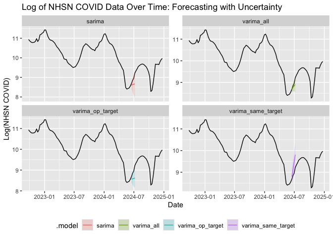

# Prototyping VARIMA for forecasting COVID-19 and Influenza


## Summary

This note prototypes using VARIMA models to forecast COVID-19 and
Influenza disease burden aggregated at the US level. The forecast target
is the publicly reported National Healthcare Safety Network (NHSN)
weekly hospitalisation numbers for COVID-19 and Influenza. As well as
the target time-series we jointly model with percentage of emergency
department (ED) visits due to each respiratory pathogen from the
National Syndromic Surveillance Program (NSSP). The scientific
hypothesis is that correlations between the time-series can be exploited
to improve forecast accuracy.

### Analysis outline

- We consider a matrix of VARIMA models with different groups of
  time-series as inputs, along with a univariate SARIMA model for
  comparison.
- We evaluate the COVID model at three time points decided by proximity
  to dynamical inflection points: at the last major peak, the summer
  upturn, and the winter upturn.
- We evaluate the Influenza model at two time points decided by
  proximity to dynamical inflection points: at the last major peak and
  the winter upturn.
- The evaluation metric is the Continuous Ranked Probability Score
  (CRPS) on out of sample log-transformed NHSN counts for 0-3 weeks
  ahead.

### Results

- The best performing model varies across time points and diseases.
- The SARIMA model was never the worst performing model, whereas the
  VARIMA model with all time-series as inputs varied from best
  performing model to worst performing model.

### Limitations

- Not all time points were evaluated for both diseases.
- Not all possible VARIMA models were evaluated.
- Right-truncation/nowcasting was only implemented by filtering the data
  so that only data before the forecast date was used, e.g. the
  “nowcast” is a one week ahead forecast using data up to the previous
  week.
- Each scoring run was only evaluated against a single target. We may
  want to consider joint scoring across targets, e.g jointly forecasting
  COVID-19 and Influenza.

### Implications

The main implication is that in a situation where the best performing
model varies across time points and diseases, it may be beneficial to
use an ensemble of models.

## Setup

This note requires the dependencies of the local package `hewr` and the
`epidatr` package. The `hewr` package contains the functions to pull the
NHSN. The `epidatr` package contains the functions to pull the NSSP
data. The other packages are for data manipulation, forecasting, and
visualization and are dependencies of the `hewr` package. The models are
implemented using the `fable` package. The scoring is done using the
`fabletools` package.

``` r
library(pak)
pak::local_install("../../hewr", ask = FALSE) #For deps
pak::pkg_install("epidatr", ask = FALSE)

library(fable)
library(fabletools)
library(tsibble)
library(epidatr)
library(dplyr)
library(purrr)
library(lubridate)
library(forecasttools)
library(tidyr)
library(ggplot2)
```

## Data wrangling

We use pubicily available data from the National Healthcare Safety
Network (NHSN) and the National Syndromic Surveillance Program (NSSP).
The NHSN data is the weekly hospitalisation numbers for COVID-19 and
Influenza. The NSSP data is the percentage of emergency department (ED)
visits due to each respiratory pathogen. We aggregate the data at the US
level and log-transform the data. For NHSN the time value is bumped by
one day to align with the NSSP data.

``` r
signals <- c("pct_ed_visits_covid","pct_ed_visits_influenza")
nhsn_cols <- c("totalconfflunewadm", "totalconfc19newadm")

offset <- 1e-3
nssp <- pub_covidcast(
            source = "nssp",
            signals = signals,
            geo_type = "nation",
            time_type = "week",
            as_of = NULL,
        ) |>
        select(geo_value, signal, time_value, value)

nhsn <- pull_nhsn(
            columns = nhsn_cols,
        ) |>
        mutate(time_value = lubridate::as_date(weekendingdate) + 1) |>
        mutate(nhsn_influenza = as.numeric(totalconfflunewadm),
            nhsn_covid = as.numeric(totalconfc19newadm)) |>
        pivot_longer(all_of(c("nhsn_influenza", "nhsn_covid")),
            names_to = "signal") |>
        group_by(time_value, signal) |>
        summarise(value = sum(value, na.rm = TRUE)) |>
        mutate(geo_value = "us") |>
        filter(time_value %in% nssp$time_value)

us_data <- bind_rows(nssp, nhsn) |>
    pivot_wider(names_from = signal, values_from = value) |>
    mutate(across(
        .cols = all_of(c("nhsn_influenza", "nhsn_covid", signals)),
        .fns = ~ log(. + offset),
        .names = "log_{.col}"
    )) |>
    as_tsibble(index = time_value)
```

## Models

Two pathogens are considered: COVID-19 and Influenza. We consider a
matrix of VARIMA models with different groups of time-series as inputs,
along with a univariate SARIMA model `sarima` for comparison. Each model
uses the target time series as a response variable. Additionally the
VARIMA models use one of the following options:

- `varima_same_target`: The log-transformed NSSP data for the same
  pathogen as the target.
- `varima_op_target`: The log-transformed NSSP data for the other
  pathogen.
- `varima_all`: All log-transformed time-series, including the NHSN data
  for the other pathogen and NSSP data for both pathogens.

In each case we used the `pdq` function to search for the best (V)ARIMA
order for the model using `fable` default methods, except for the
`varima_all` model where there was numerical instability. We responded
to the numerical instability by setting the differencing order `d=1`
along with the default seach over orders `p<-0:5`, `q<-0:5`. Options
`d=0` and `d=2` were also tried but found to be numerically unstable.
NB: Seasonal differencing is not automatically applied to VARIMA models
in `fable`.

The forecast horizon is set to 4 weeks. However, data on the forecast
week is not used in the model fitting as an approximation to avoiding
right-trunction effects (see limitations in [Summary](#summary)),
therefore, this represents a 0-3 week ahead forecast with `h=0` being a
nowcast.

``` r
model_configs_covid = list(
    list(name = "sarima", model = ARIMA(log_nhsn_covid)),
    list(name = "varima_same_target", model = VARIMA(vars(log_nhsn_covid, log_pct_ed_visits_covid) ~ pdq())),
    list(name = "varima_op_target", model = VARIMA(vars(log_nhsn_covid, log_pct_ed_visits_influenza) ~ pdq())),
    list(name = "varima_all", model = VARIMA(vars(log_nhsn_covid, log_nhsn_influenza, log_pct_ed_visits_covid, log_pct_ed_visits_influenza) ~ pdq(0:5,1,0:5)))
)

model_configs_influenza = list(
    list(name = "sarima", model = ARIMA(log_nhsn_influenza)),
    list(name = "varima_same_target", model = VARIMA(vars(log_nhsn_influenza, log_pct_ed_visits_influenza) ~ pdq())),
    list(name = "varima_op_target", model = VARIMA(vars(log_nhsn_influenza, log_pct_ed_visits_covid) ~ pdq())),
    list(name = "varima_all", model = VARIMA(vars(log_nhsn_covid, log_nhsn_influenza, log_pct_ed_visits_covid, log_pct_ed_visits_influenza) ~ pdq(0:5,1,0:5)))
)

forecast_horizon <- "4 weeks"
```

### Helper functions

We define two helper functions to generate fits and scores for a list of
models and to summarize forecasts from a list of fits.

``` r
generate_fits_and_scores <- function(model_configs, us_data, cutoff_data,
    target_name, target_col, fc_str = "4 weeks"){
    us_data_redacted  <- us_data |> filter(time_value < cutoff_data)

    fits <- model_configs |>
        map(function(x) {
        us_data_redacted |> model(!!x$name := x$model) } )

    forecasts <- fits |>
        map(\(x) forecast(x, h = fc_str))

    scores <- forecasts |>
        map(\(x) accuracy(x, us_data, measures = list(crps_score = CRPS))) |>
        bind_rows() |>
        mutate(.response = ifelse(is.na(.response), !!target_col, .response)) |>
        filter(.response == !!target_col) |>
        arrange(crps_score) |>
        mutate(target = !!target_name)

    return(list(fits = fits, scores = scores))
}
```

``` r
summarize_forecasts <- function(fits, target_col, forecast_horizon,
    times = 2000){
        summary_forecasts <- fits |>
            map(
                function(x){
                    x |>
                    generate(times = times, h = forecast_horizon) |>
                    as_tibble() |>
                    rename_with(\(z) target_col, any_of(c(".sim", target_col))) |>
                    select(.model, time_value, !!target_col, .rep) |>
                    group_by(time_value, .model) |>
                    summarise(
                        median_forecast = median(!!sym(target_col)),
                        lower_ci = quantile(!!sym(target_col), probs = 0.025),
                        upper_ci = quantile(!!sym(target_col), probs = 0.975)
                    )
                }
            ) |>
    bind_rows()
    return(summary_forecasts)
}
```

## Results

### COVID-19

We choose three dates to evaluate the model matrix with a target of
COVID-19:

- 31st Dec 2023. The week before the last major peak.
- 16th June 2024. A week near start of the summer upturn.
- 3rd Nov 2024. A week near start of the winter upturn.

#### COVID-19: Last peak

``` r
wk_bf_mj_peak <- as.Date("2023-12-31")

D <- generate_fits_and_scores(model_configs_covid, us_data, wk_bf_mj_peak,
    target_name = "covid", target_col = "log_nhsn_covid", fc_str = forecast_horizon)
D$scores
```

    # A tibble: 4 × 5
      .model             .type crps_score .response      target
      <chr>              <chr>      <dbl> <chr>          <chr> 
    1 sarima             Test      0.0852 log_nhsn_covid covid 
    2 varima_op_target   Test      0.185  log_nhsn_covid covid 
    3 varima_all         Test      0.217  log_nhsn_covid covid 
    4 varima_same_target Test      0.219  log_nhsn_covid covid 

``` r
summary_forecasts <- summarize_forecasts(D$fits, "log_nhsn_covid", forecast_horizon)

plt <- ggplot() +
    geom_line(data = us_data, aes(x = time_value, y = log_nhsn_covid)) +
    geom_ribbon(data = summary_forecasts, aes(x = time_value, ymin = lower_ci, ymax = upper_ci, fill = .model), alpha = 0.2) +
    geom_line(data = summary_forecasts, aes(x = time_value, y = median_forecast, color = .model)) +
    labs(title = "Log of NHSN COVID Data Over Time: Forecasting with Uncertainty",
        x = "Date",
        y = "Log(NHSN COVID)") +
    theme(legend.position = "bottom") +
    facet_wrap(~ .model, scales = "free_y")
plt
```


#### COVID-19: Summer upturn

``` r
wk_bf_summer_uptick <- as.Date("2024-06-16")

D <- generate_fits_and_scores(model_configs_covid, us_data, wk_bf_summer_uptick,
    target_name = "covid", target_col = "log_nhsn_covid", fc_str = forecast_horizon)
D$scores
```

    # A tibble: 4 × 5
      .model             .type crps_score .response      target
      <chr>              <chr>      <dbl> <chr>          <chr> 
    1 varima_all         Test      0.0984 log_nhsn_covid covid 
    2 sarima             Test      0.187  log_nhsn_covid covid 
    3 varima_op_target   Test      0.244  log_nhsn_covid covid 
    4 varima_same_target Test      0.265  log_nhsn_covid covid 

``` r
summary_forecasts <- summarize_forecasts(D$fits, "log_nhsn_covid", forecast_horizon)

plt <- ggplot() +
    geom_line(data = us_data, aes(x = time_value, y = log_nhsn_covid)) +
    geom_ribbon(data = summary_forecasts, aes(x = time_value, ymin = lower_ci, ymax = upper_ci, fill = .model), alpha = 0.2) +
    geom_line(data = summary_forecasts, aes(x = time_value, y = median_forecast, color = .model)) +
    labs(title = "Log of NHSN COVID Data Over Time: Forecasting with Uncertainty",
        x = "Date",
        y = "Log(NHSN COVID)") +
    theme(legend.position = "bottom") +
    facet_wrap(~ .model, scales = "free_y")
plt
```



#### COVID-19: Winter upturn

``` r
wk_bf_winter_uptick <- as.Date("2024-11-03")

D <- generate_fits_and_scores(model_configs_covid, us_data, wk_bf_winter_uptick,
    target_name = "covid", target_col = "log_nhsn_covid", fc_str = forecast_horizon)
D$scores
```

    # A tibble: 4 × 5
      .model             .type crps_score .response      target
      <chr>              <chr>      <dbl> <chr>          <chr> 
    1 varima_op_target   Test       0.293 log_nhsn_covid covid 
    2 sarima             Test       0.571 log_nhsn_covid covid 
    3 varima_same_target Test       0.756 log_nhsn_covid covid 
    4 varima_all         Test       0.797 log_nhsn_covid covid 

``` r
summary_forecasts <- summarize_forecasts(D$fits, "log_nhsn_covid", forecast_horizon)

plt <- ggplot() +
    geom_line(data = us_data, aes(x = time_value, y = log_nhsn_covid)) +
    geom_ribbon(data = summary_forecasts, aes(x = time_value, ymin = lower_ci, ymax = upper_ci, fill = .model), alpha = 0.2) +
    geom_line(data = summary_forecasts, aes(x = time_value, y = median_forecast, color = .model)) +
    labs(title = "Log of NHSN COVID Data Over Time: Forecasting with Uncertainty",
        x = "Date",
        y = "Log(NHSN COVID)") +
    theme(legend.position = "bottom") +
    facet_wrap(~ .model, scales = "free_y")
plt
```


### Influenza

We choose two dates to evaluate the model matrix with a target of
Influenza:

- 24th Dec 2023. The week before the last major peak.
- 13th Oct 2024. A week near the beginning of the winter upturn.

#### Influenza: Last peak

``` r
wk_bf_mj_peak <- as.Date("2023-12-24")

D <- generate_fits_and_scores(model_configs_influenza, us_data, wk_bf_mj_peak,
    target_name = "influenza", target_col = "log_nhsn_influenza", fc_str = forecast_horizon)
D$scores
```

    # A tibble: 4 × 5
      .model             .type crps_score .response          target   
      <chr>              <chr>      <dbl> <chr>              <chr>    
    1 varima_same_target Test       0.119 log_nhsn_influenza influenza
    2 varima_op_target   Test       0.134 log_nhsn_influenza influenza
    3 sarima             Test       0.153 log_nhsn_influenza influenza
    4 varima_all         Test       0.663 log_nhsn_influenza influenza

``` r
summary_forecasts <- summarize_forecasts(D$fits, "log_nhsn_influenza", forecast_horizon)

plt <- ggplot() +
    geom_line(data = us_data, aes(x = time_value, y = log_nhsn_influenza)) +
    geom_ribbon(data = summary_forecasts, aes(x = time_value, ymin = lower_ci, ymax = upper_ci, fill = .model), alpha = 0.2) +
    geom_line(data = summary_forecasts, aes(x = time_value, y = median_forecast, color = .model)) +
    labs(title = "Log of NHSN Influenza Data Over Time: Forecasting with Uncertainty",
        x = "Date",
        y = "Log(NHSN Influenza)") +
    theme(legend.position = "bottom") +
    facet_wrap(~ .model, scales = "free_y")
plt
```


#### Influenza: Winter upturn

``` r
wk_bf_summer_uptick <- as.Date("2024-10-13")

D <- generate_fits_and_scores(model_configs_influenza, us_data, wk_bf_summer_uptick,
    target_name = "influenza", target_col = "log_nhsn_influenza", fc_str = forecast_horizon)
D$scores
```

    # A tibble: 4 × 5
      .model             .type crps_score .response          target   
      <chr>              <chr>      <dbl> <chr>              <chr>    
    1 varima_op_target   Test       0.202 log_nhsn_influenza influenza
    2 sarima             Test       0.292 log_nhsn_influenza influenza
    3 varima_same_target Test       0.487 log_nhsn_influenza influenza
    4 varima_all         Test       1.42  log_nhsn_influenza influenza

``` r
summary_forecasts <- summarize_forecasts(D$fits, "log_nhsn_influenza", forecast_horizon)

plt <- ggplot() +
    geom_line(data = us_data, aes(x = time_value, y = log_nhsn_influenza)) +
    geom_ribbon(data = summary_forecasts, aes(x = time_value, ymin = lower_ci, ymax = upper_ci, fill = .model), alpha = 0.2) +
    geom_line(data = summary_forecasts, aes(x = time_value, y = median_forecast, color = .model)) +
    labs(title = "Log of NHSN Influenza Data Over Time: Forecasting with Uncertainty",
        x = "Date",
        y = "Log(NHSN Influenza)") +
    theme(legend.position = "bottom") +
    facet_wrap(~ .model, scales = "free_y")
plt
```


